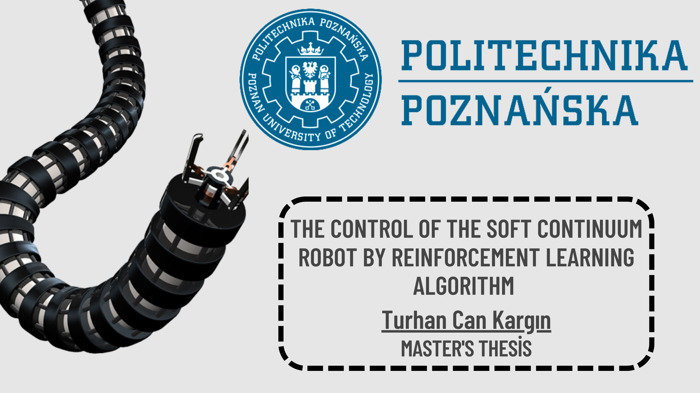
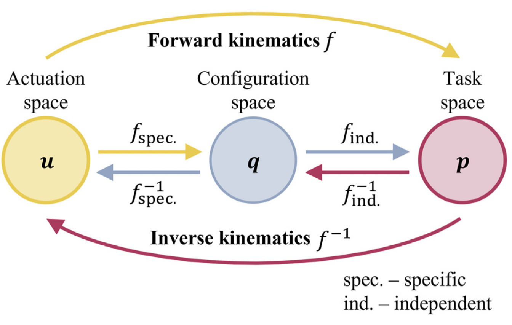
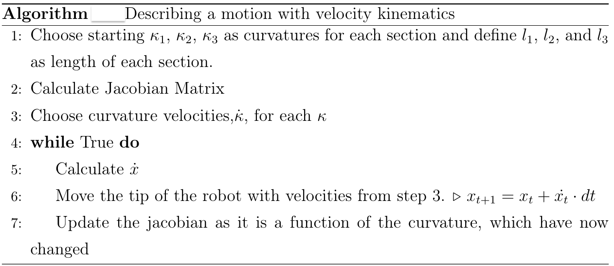
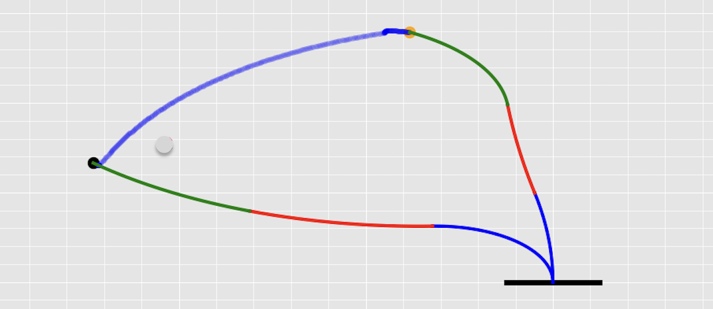
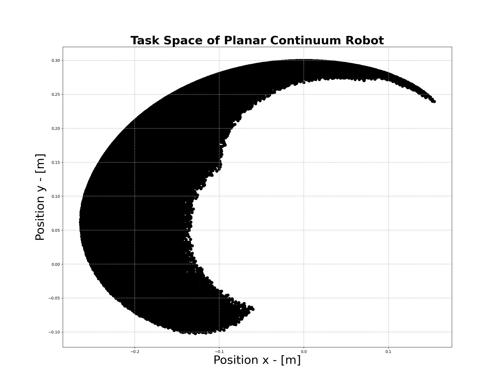
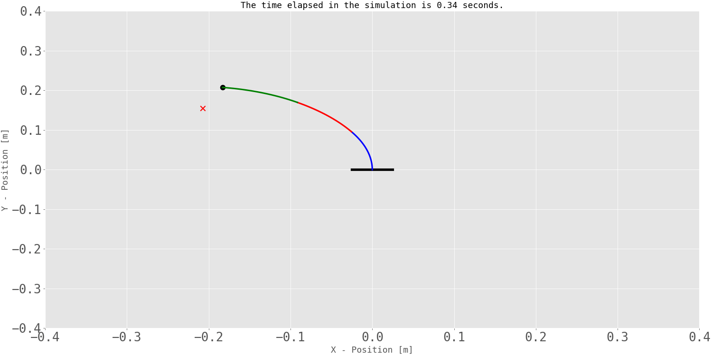
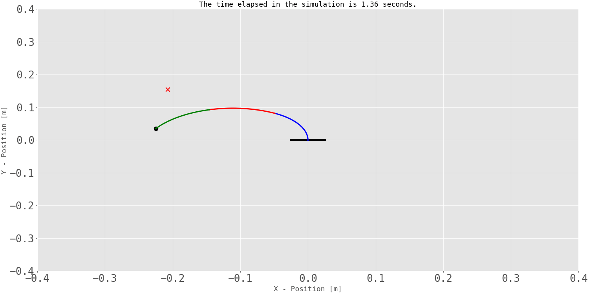
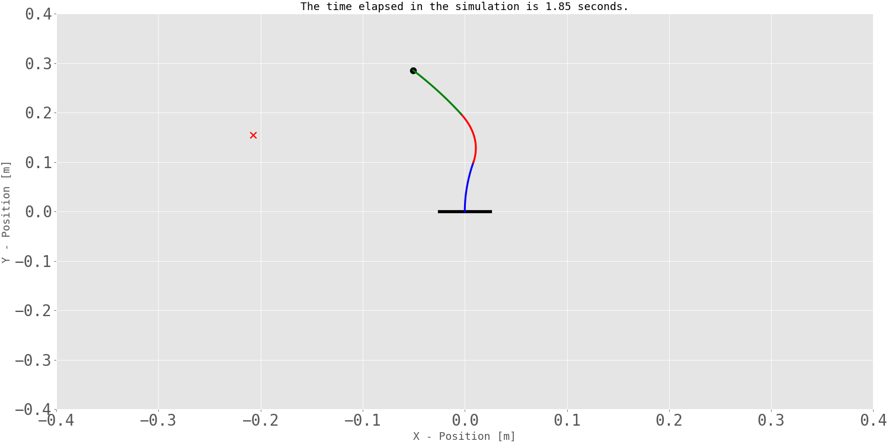
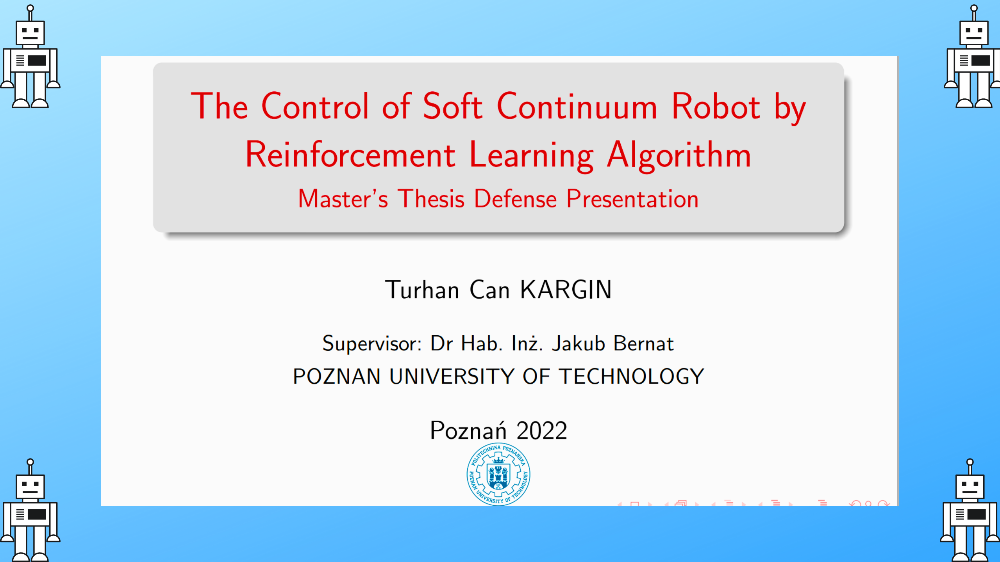

# The Control of the Soft Continuum Robot by Reinforcement Learning Algorithm

* **Author:** [Turhan Can Kargın](https://github.com/turhancan97)
* **Topic:** Master's Thesis 

***Please Click The Picture Below For the Project Video***

-----------------------

# How to use

1. Create the environment from the `environment.yml` file:
    * `conda env create -f environment.yml`
2. Activate the new environment: `conda activate continuum-rl`
3. git clone `https://github.com/turhancan97/RL-based-Control-of-a-Soft-Continuum-Robot.git`
4. Run `cd RL-based-Control-of-a-Soft-Continuum-Robot/Tests` on the terminal
5. Run `python DDPG_keras_test.py` or `python DDPG_pytorch_test.py` on the terminal

**Note:** Another way is to create your own environment, activate the environment and run `pip install -r requirements.txt`. Then continue from step 3 above.

# About the Project

This project was prepared for my thesis project in the Automatic Control and Robotics master program at Poznan University of Technology. 

In this repository, a detailed formulation and explanation of the forward kinematics and velocity kinematics model for continuum robots is presented. In addition, reinforcement learning algorithm has been applied for the control of the three section continuum robot. Since the robot control problem is continuous, traditional algorithms of reinforcement learning cannot produce a solution. Deep Deterministic Policy Gradient (DDPG) algorithm, which is one of the reinforcement learning algorithms, has been chosen for the continuum robot control problem within the scope of this project, since it provides continuous state and continuous action space. Finally, the algorithm developed in Python programming language and some of the common frameworks such as OpenAI gym, Keras, Pytorch and Numpy. 

## Kinematics Modelling of Continuum Robot

Kinematics is a sub-branch of physics that deals with the motion of objects. It examines the position, velocity, acceleration and jerk values of rigid objects according to a reference coordinate system. Kinematics is not concerned with the forces and moments that cause motion; that is studied in dynamics. In this project, forward and velocity kinematics calculations were made for continuum robots using the constant curvature method. The inverse kinematics of the continuum robot is not calculated. Forward and inverse kinematics of continuum robot can be seen in Figure below.

<figure align="center"> 
  
  <figcaption>X. Wang, Y. Li, and K. Kwok. A survey for machine learning-based control of continuum robots. Frontiers in Robotics and AI, 2021</figcaption>
</figure>

### Forward Kinematics
In order to calculate the forward and velocity kinematics of the three-section continuum robot, we employed the methods of (Hannan and Walker, 2003). This section will focus on the discussion of forward kinematics. 

The authors utilized a modified Denavit-Hartenberg method to perform forward kinematic analysis of continuum robots. This method is widely recognized and utilized. Unlike the original D-H approach, which assumes each joint is independent, the modified D-H approach links three motions by curvature.

Therefore, using the D-H method, the homogeneous transformation matrix for the curve from frame 0 to frame 3 can be written in terms of the curvature $\kappa$ and the total arc length $l$ as

$$\begin{align}
    A_{0}^{3}=A_{0}^{1}A_{1}^{2}A_{2}^{3}=\left[\begin{array}{cccc}
\cos (\kappa l) & -\sin (\kappa l) & 0 & \frac{\mathbf{1}}{\kappa}\{\cos (\kappa l)-1\} \\
\sin (\kappa l) & \cos (\kappa l) & 0 & \frac{\mathbf{1}}{\kappa} \sin (\kappa l) \\
0 & 0 & 1 & 0 \\
0 & 0 & 0 & 1
\end{array}\right]
\end{align}$$

The frames for a three section continuum robot can be setup as a combination of three sections. So, the transformation matrix from frame 0 to frame 9 is:

$$\begin{align}
A_{0}^{9}= A_{0}^{3}A_{3}^{6}A_{6}^{9} = \left[\begin{array}{cccc}
\cos \left(\omega_{1}+\omega_{2}+\omega_{3}\right) & -\sin \left(\omega_{1}+\omega_{2}+\omega_{3}\right) & 0 & A_{14} \\
\sin \left(\omega_{1}+\omega_{2}+\omega_{3}\right) & \cos \left(\omega_{1}+\omega_{2}+\omega_{3}\right) & 0 & A_{24} \\
0 & 0 & 1 & 0 \\
0 & 0 & 0 & 1
\end{array}\right]
\end{align}$$

The previously undefined matrix elements are given as:

$$\begin{align}
\begin{aligned}
A_{14}=& \frac{1}{\kappa_{1}}\left(\cos \omega_{1}-1\right)+\frac{1}{\kappa_{2}}\left(\cos \left(\omega_{1}+\omega_{2}\right)-\cos \omega_{1}\right) \\
&+\frac{1}{\kappa_{3}}\left(\cos \left(\omega_{1}+\omega_{2}+\omega_{3}\right)-\cos \left(\omega_{1}+\omega_{2}\right)\right) \\
A_{24}=& \frac{1}{\kappa_{1}} \sin \omega_{1}+\frac{1}{\kappa_{2}}\left(\sin \left(\omega_{1}+\omega_{2}\right)-\sin \omega_{1}\right) \\
&+\frac{1}{\kappa_{3}}\left(\sin \left(\omega_{1}+\omega_{2}+\omega_{3}\right)-\sin \left(\omega_{1}+\omega_{2}\right)\right)
\end{aligned}
\end{align}$$

where $\kappa_{i}$ and $l_{i}$ are the curvature and total arc length respectively for section $i$ and $\omega_{i}=\kappa_{i} l_{i}$ for $i=\{1,2,3\}$. Note, the total arc length for $i=\{1,2\}$ must be used so that section 3 is properly oriented, but any arc length can be used for the final section depending on where the point of interest lies in the section. The total arc length for the final section gives the kinematics in terms of the end point.

In Figure below, you can see the simulated forward kinematics model of our robot with $\kappa_1 = 1.7035 [\frac{1}{m}]$, $\kappa_2 = 1.0 [\frac{1}{m}$], and $\kappa_3 = 2.0 [\frac{1}{m}]$ as curvature values of each section and $l_1 = 0.1 [m]$, $l_2 = 0.1 [m]$, and $l_3 = 0.1 [m]$ as length of each section.

<figure align="center">

  <figcaption>Forward Kinematics Implementation</figcaption>
</figure>

### Velocity Kinematics
The velocity kinematics of a continuum robot can be expressed in a way that is similar to conventional kinematic analysis (Spong and Vidyasagar, 1989).

$$\begin{align}
    \dot{x} = J\dot{q},
\end{align}$$

For our three-section planar robot, the task space vector $x\in \mathbb{R}^{m\times 1}$ represents its position and/or orientation, and the dot indicates differentiation with respect to time.

$$\begin{align}
    \mathbf{q} = \left [ \kappa _1, \kappa _2, \kappa _3 \right ]^T, \\
    \mathbf{\dot{q}} = \left [ \dot{\kappa _1}, \dot{\kappa _2}, \dot{\kappa _3} \right ]^T, \\
    \mathbf{\dot{x}} = \left [ \dot{x}, \dot{y} \right ]^T
\end{align}$$

The matrix $J$ represents the Jacobian and depends on the 'joint' (curvature in the context of continuum robot) variables $\mathbf{q}$. The elements of the Jacobian $J_{ij}$ can be found by taking partial derivatives of the forward kinematic equations, as described below:

$$\begin{align}
    \begin{bmatrix}
\dot{x}\\ 
\dot{y}
\end{bmatrix} = \begin{bmatrix}
J_{11} & J_{12} \\ 
J_{21} & J_{22}
\end{bmatrix} \begin{bmatrix}
\dot{q_1}\\ 
\dot{q_2}
\end{bmatrix},
\end{align}$$

If we apply the chain rule, we obtain the following equation:

$$\begin{align}
\frac{dx}{dt} = \frac{\partial x}{\partial q_1} \frac{d q_1}{dt} + \frac{\partial x}{\partial q_2} \frac{d q_2}{dt}, \\ 
\frac{dy}{dt} = \frac{\partial y}{\partial q_1} \frac{d q_1}{dt} + \frac{\partial y}{\partial q_2} \frac{d q_2}{dt}
\end{align}$$

Let's apply this to our case, as shown in the equation below:

$$\begin{align}
    \frac{dx}{dt} = {\color{red} \frac{\partial x}{\partial \kappa_1}} \frac{d \kappa_1}{dt} + {\color{red} \frac{\partial x}{\partial \kappa_2} }\frac{d\kappa_2}{dt} +{\color{red}  \frac{\partial x}{\partial \kappa_3}} \frac{d \kappa_3}{dt}, \\
    \frac{dy}{dt} ={\color{red}  \frac{\partial y}{\partial \kappa_1}} \frac{d \kappa_1}{dt} + {\color{red} \frac{\partial y}{\partial \kappa_2}} \frac{d \kappa_2}{dt} + {\color{red} \frac{\partial y}{\partial \kappa_3}} \frac{d \kappa_3}{dt}
\end{align}$$

The red elements in the equation above represent the elements of our Jacobian Matrix. To define the Jacobian Matrix, we can use the equation below:

$$\begin{align}
    J = 
\begin{bmatrix}
 \frac{\partial x}{\partial \kappa_1}& \frac{\partial x}{\partial \kappa_2} &  \frac{\partial x}{\partial \kappa_3}\\
\frac{\partial y}{\partial \kappa_1} & \frac{\partial y}{\partial \kappa_2} & \frac{\partial y}{\partial \kappa_3} \\
\end{bmatrix}
\end{align}$$

As a result, the final form of equation is:

$$\begin{align}
    \begin{bmatrix}
\frac{dx}{dt} \\ \frac{dy}{dt}
\end{bmatrix} =\begin{bmatrix}
 \frac{\partial x}{\partial \kappa_1}& \frac{\partial x}{\partial \kappa_2} &  \frac{\partial x}{\partial \kappa_3}\\
\frac{\partial y}{\partial \kappa_1} & \frac{\partial y}{\partial \kappa_2} & \frac{\partial y}{\partial \kappa_3} \\
\end{bmatrix} \begin{bmatrix}
\frac{d \kappa_1}{dt} \\ \frac{d \kappa_2}{dt}
 \\ \frac{d \kappa_3}{dt}
\end{bmatrix}
\end{align}$$

Jacobian matrices are a useful tool in robotics and control theory that explain the dynamic relationship between different system representations, such as position and curvature derivatives. In velocity kinematics, these matrices are used to describe the highly constrained motion of the end-effector (tip of the continuum robot).

<figure align="center"> 
  
</figure>

In the algorithm described above, we applied it to depict the motion of the continuum robot. You can view the simulated velocity kinematics motion of our robot below by applying the algorithm. It portrays solely the motion of the continuum robot’s tip point. For this project, we utilized forward and velocity kinematics models to design a reinforcement learning environment that describes the three section continuum robot. The next section will delve into the specifics of the environment designed for reinforcement learning.

<figure align="center"> 
  
</figure>

## Environment Design
We simulated a continuum robot with a section length of 0.1 $[m]$ and a curvature range of $-4 [\frac{1}{m}] \leq \kappa \leq 16 [\frac{1}{m}]$. The robot is mounted at the point (0,0) at its base.

Our system's aim is to take the three segment continuum robot from a random starting point to a random target by using  the forward kinematics and velocity kinematics to describe the continuum robot.

* $x-y$: cartesian coordinates of the robot's tip point $m$. We don't have z axis since planar case for continuum robot was considered.
* $\kappa$: Curvatures  $\frac{1}{m}$. 
* $\dot{\kappa}$: Derivative of curvatures $\frac{1}{\frac{m}{s}}$.
* $l$ - section length $[m]$
### Action Space

Action refers to the artificial agent selecting an option from a provided list of actions. In this thesis, the agent's action is represented by a data structure consisting of an `ndarray` with a shape of `(3,)` that represents the curvature derivative of each segment. While the agent is navigating the environment, it will generate three different values for the rate of change of curvature that are continuous at each step. Based on the rate of change, the robot must move towards the intended target.

### State Space
The state that is being designed for this project includes the current x and y coordinates of the robot in the cartesian system, as well as the x and y coordinates of the target point.

### Reward Functions

<figure align="center">

  <figcaption>Task Space of three section continuum robot</figcaption>
</figure>

To finalize the environment, we need to design the reward. The state space has been intentionally limited to match the robot's task space (check Figure above), making it easier to describe the reward function. We define the Euclidean distance to $x_{goal}$ as follows:

$$ \begin{equation}
    d_u = \sqrt{(x-x_{goal})^2+(y-y_{goal})^2}
\end{equation} $$

The reward can be defined in different ways to showcase its significant impact on the learning process. The first reward is given as:

$$ \begin{equation}
   r_1 = -1\cdot (d_u)^{2}
\end{equation} $$

The second reward function is defined as:

$$ \begin{equation}
   r_2 = \left\{\begin{matrix}
1 & d_u < d_{u-1}\\ 
-0.5 & d_u =  d_{u-1}\\
-1 & d_u >  d_{u-1}
\end{matrix}\right.
\end{equation} $$

The third reward is calculated based on the weighted distance:

$$ \begin{equation}
r_3 = -0.7\times d_u
\end{equation} $$

The final reward is:

$$ \begin{equation} 
r_4 = \left\{\begin{matrix}
 200 & d_u \leq 0.025 \\ 
 150 & d_u \leq 0.05 \\ 
 100 & d_u \leq 0.1 \\ 
 100\times (d_{u-1} - d_u) & d_u > 0.1 \\
-100 & d_u = d_{u-1}  
\end{matrix}\right.
\end{equation} $$

## Simulations

### Diagram of Training Process

### Diagram of Testing Process

### Results

Some of the results can be seen in this section. Each demonstration has a different reward function implemented.

# Conclusion

This project discusses the use of reinforcement learning algorithms to solve the control problem of continuum robots, which have high degrees of freedom and unmodelable dynamics. The superiority of reinforcement learning over classical model-based approaches is that the reward function is created specifically for the problem. The project focuses on the curvature control problem of the continuum robot, which is solved using the Deep Deterministic Policy Gradient Algorithm, a model-free deep reinforcement learning algorithm. 

# TODOs

* [ ] Add different reward functions than distance based.
* [ ] Take into account the robot's orientation.
* [ ] For high-level control, the problem of the robot creating a path planning in the environment by adding obstacles to its environment can be solved with this algorithm.
* [ ] 2D moving target point can be designed and tracked.
* [ ] 3D position reaching problem can be solved.
* [ ] 3D position tracking problem can be solved.
* [ ] Try different RL algorithms, such as Trust Region Policy Optimization (TRPO) or Proximal Policy Optimization (PPO).
* [ ] A real continuum robot can be designed and the same algorithm can be tested on this robot.

# Final Words

You can check my thesis report, presentation and LaTeX files in [here](/Thesis/).

---

You can also click on the image below if you want to see my thesis defense presentation video.

** Please feel free to contribute to this project. **